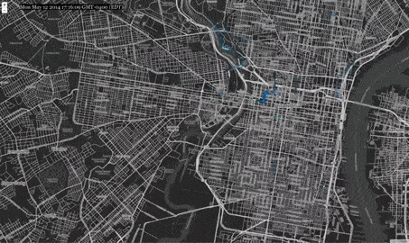
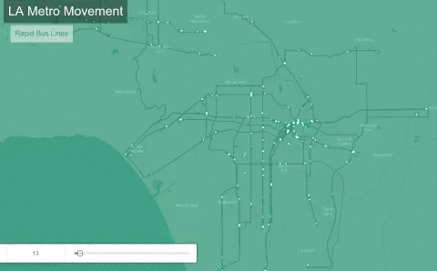
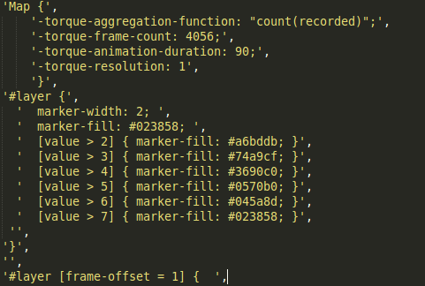
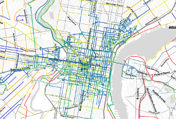
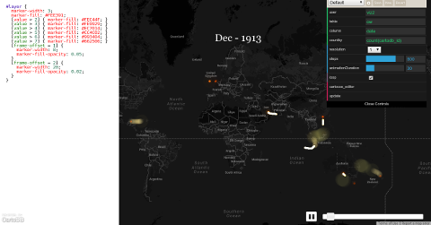

# Using Torque Outside of CartoDB #





### Talk at [FOSS4G NA 2015](https://2015.foss4g-na.org/session/torque-time-lapse-map-animations-outside-cartodb)


## Kathryn Killebrew | Software Developer ##


# What is Torque? #


[Torque](https://github.com/CartoDB/torque) is an open-source JavaScript library from CartoDB for

time series map visualization.


# How are Torque Visualizations Created? #


The simplest way to create a Torque time-lapse animation is to upload the data to a CartoDB account,

then select the Torque option from the visualization wizard.  Here's an example of [L.A. rapid buses](https://d9a.cartodb.com/viz/fe9751f0-6ced-11e4-98f3-0e9d821ea90d/public_map).





CartoDB visualizations can also be embedded on other pages. The CartoDB [Torque tutorial page](http://docs.cartodb.com/tutorials/introduction_torque.html) contains an embedded Torque animation.

# How is Torque JS designed to be used? #


The Torque JavaScript library will let you create a Torque map layer that can be added to

a Leaflet or Google Maps base layer on your own web page. 


The layer is defined with the user name of a CartoDB account to use, the name of the table to 

visualize from the CartoDB account, and some special CartoCSS to define aspects of the animation.


Here's an [example](http://cartodb.github.io/torque/examples/navy_leaflet) from the Torque project

GitHub Pages. The [source](https://github.com/CartoDB/torque/blob/master/examples/navy_leaflet.html)

is under the project's `examples` directory.


# Can Torque be used without uploading the data to CartoDB? #


A third option for using Torque, which we will explore today, is to use the library in conjunction 

with two other CartoDB JavaScript libraries to connect to data that is not uploaded to a CartoDB 

account, but is rather in our own PostGIS-enabled PostgreSQL database.


This presentation walks through setting up a stand-alone Torque animation.


# How Does Torque Work? #


Torque is part of the suite of projects that make up the CartoDB web service.

It's designed to work with the other projects, particularly the Windshaft tiler and SQL API service.

Torque queries the SQL API when initializing to get metadata about the table, such as the time 

period covered and bounding box for the points, then fetches the animation from Windshaft.


The Torque animation is configured using special CartoCSS, defining aspects such as frame count,

animation duration, and the color and size of the markers used at different frame offsets.


# Okay, How Does CartoDB Work? #


CartoDB has several open-source components:


*  The [web site](https://github.com/CartoDB/cartodb) itself, which manages user-name references by

   giving each user a subdomain that is the user name.

*  Each user gets their own PostgreSQL role and database with the PostGIS extensions installed.

   There are a number of triggers installed, as well as extra functions from [this project](https://github.com/CartoDB/cartodb-postgresql).

*  The database gets queried via their JavaScript [SQL API](https://github.com/CartoDB/CartoDB-SQL-API).

   The SQL API authenticates with the database by getting the user account name from the subdomain,

   accepting an API key parameter, and finding current user credentials in Redis storage.

*  Map tiles are served via the JavaScript [Windshaft](https://github.com/CartoDB/Windshaft) library.

   Windshaft works quite well on its own outside of a full CartoDB installation.

# Um, Why Are You Doing This? #


Working on a volunteer project, [CyclePhilly](http://cyclephilly.org/).

Already had a Windshaft server with PostGIS-enabled database [displaying trips](http://banderkat.net/);

wanted to add Torque animations.




# So How Do I Use Torque Without the Other Stuff? #


Torque only really needs the Windshaft tiler and SQL API CartoDB projects to work.

The Torque and Windshaft projects can be used without modification.


The SQL API will need to be set up to operate without user credentials from the CartoDB web app.

I'll share a fork of the project I've configured to work as a stand-alone SQL API.


Note that redis is a dependency of both Windshaft and the SQL API; it's used for caching.


The database is the one other component we'll need.

# How Do I Set Up the Database? #


*  PostGIS-enables Postgres database


* There are a number of CartoDB functions in [this project](https://github.com/CartoDB/cartodb-postgresql)

  that Torque and the SQL API will expect to be defined.  (The triggers are unnecessary.)

  The scripts may be found [here](https://github.com/CartoDB/cartodb-postgresql/tree/master/scripts-enabled)

  in the `scripts-enabled` directory.  In particular, `CDB_QueryStatements.sql` and `CDB_QueryTables.sql`

  are needed.


*  Allow local database connections via password authentication. Edit `pg_hba.conf` and change:

   ```

   local   all             all                                     peer

   ```

   to:

   ```

   local   all             all                                     md5

   ```

# How Do I Set Up the Database Table? #


Four columns are needed:


*  A unique identifier (used for aggregation functions)

*  A timestamp

*  A PostGIS Point column, named `geom`, in EPSG 4326. (The SQL API has a hard-coded reference to

   the geometry column for the table.  It was `the_geom`, but I renamed it in my fork.)

*  A PostGIS Point column, named `the_geom_webmercator`, in EPSG 3857. (The Torque library has

   this column name hard coded for use in querying Windshaft.) I've found it necessary to fill

   this column by using the CartoDB function `CDB_TransformToWebmercator` instead of using 

   the PostGIS `ST_Transform` function directly.

# Setting up Windshaft #


* Minimal example configuration files are in the project, in `config/environments`.


* [Here](https://gist.github.com/flibbertigibbet/5a971283c1f87aa4f598) is an example configuration

  file for a stand-alone Windshaft configuration that will work for torque.


* The configuration defines the database name, database username and password, and for this,

  we'll define the database table to use.


* To run, put your configuration file in the top-level directory, then start with:

  `node yourconfig.js`.

# Setting up the SQL API #


Once the SQL API is set up to operate without user credentials from Redis or user and database names

from the subdomain, we're ready to go! Here's [a fork of the SQL API](https://github.com/flibbertigibbet/CartoDB-SQL-API) that has the authentication parts removed.  For permissions, we can rely on using

a database role that has read-only access to just the table with our data for Torque.


The SQL API configuration files live in `config/environments`. Copy `development.js.example` to

`development.js`, and edit:


* `db_base_name`

* `db_user` and `db_pubuser` (can be the same)

* `db_user_pass` and `db_pubuser_pass`

* Remove the `statsd` block; we won't be needing it

* For the `health` check block at the end, change the username to our database user.


To run: `node app.js` from the project top-level directory.

# Okay, cool!  Show me some examples! #


*  Bicycle trips logged using CyclePhilly: [here](http://banderkat.net/timelapse_may.html) and [here](http://banderkat.net/timelapse.html)


*  [Boston real-time bus locations](http://banderkat.net/mbta.html)


*  [SEPTA real-time bus locations](http://banderkat.net/septa.html)


# Also helpful #


*  The CartoDB GitHub account has [a page with interactive controls](http://cartodb.github.io/torque/)

   where you can change the CartoCSS and the animation settings.





* Some documention on Torque-specific CartoCSS is [here](https://github.com/CartoDB/torque/blob/master/doc/CartoCSS.md).  For an accumulating animation, set `-torque-data-aggregation` to `cumulative`.

(By default, previous values are discarded.)

# Thanks! #


## Kathryn Killebrew ##


[@Banderkat](https://twitter.com/banderkat)


<kathryn.killebrew@gmail.com>


